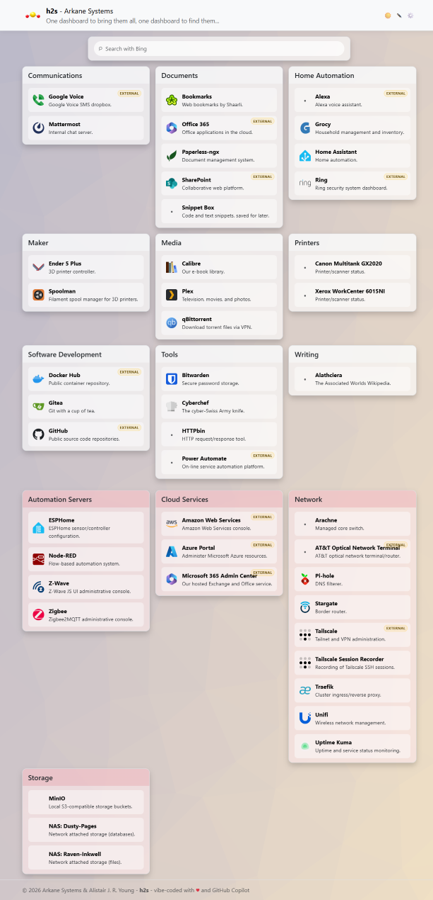
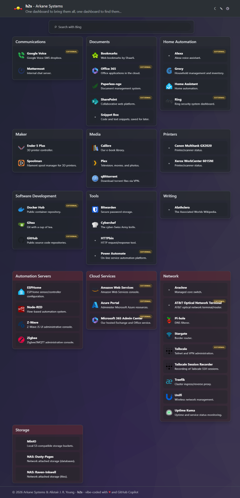

# h2s

h2s is a simple intranet dashboard app, which exists primarily because I got very tired of never finding one that precisely met my specifications. As such, it's rather tightly wrapped around my personal preferences, but it's open source and available for anyone to use or modify as they see fit. And I'm happy to accept contributions if you have ideas for improvements or new features.

It's built with ASP.NET Core Razor Pages and uses Bootstrap for styling, and stores its data in SQLite using Entity Framework Core. (Being configurable in itself and not requiring mucking around with YAML, etc., was a key requirement for me.)

The app is designed to be run in a Linux container (I do so using my Kubernetes cluster), but there's no reason it couldn't be run on Windows or macOS as well, either containerized or directly. I just haven't built deployments for those scenarios.

| Light Mode | Dark Mode |
| ------- | ------- |
|  |  |


## Build the container

From the repository root:

```bash
docker build -t h2s:local -f h2s/Dockerfile h2s
```

If you just want to run the current official build, however, it's available on GitHub Container Registry at `ghcr.io/arkane-systems/h2s:latest` (or with the specific version tag).


## Container publishing

A GitHub Actions workflow (`.github/workflows/publish-container.yml`) publishes images to GitHub Container Registry when a tag is pushed (if the tag commit is on `master`) or when manually dispatched (using the latest tag).

## Run the container (in Docker)

Create a local folder for persistent data, then run:

```bash
docker run --rm -p 8080:8080 -e ASPNETCORE_URLS=http://+:8080 -v "$(pwd)/data:/app/data" h2s:local
```

The app expects the SQLite database at `/app/data/h2s.db` inside the container.


## Running on Kubernetes

Here's a sample Kubernetes manifest for running h2s in a cluster. This creates a Namespace, Deployment, Service, and Ingress for the app.

```yaml
---
apiVersion: v1
kind: Namespace
metadata:
  name: h2s
---
apiVersion: apps/v1
kind: Deployment
metadata:
  name: h2s
  namespace: h2s
  labels:
    app: h2s
spec:
  replicas: 1
  strategy:
    type: Recreate
  selector:
    matchLabels:
      app: h2s
  template:
    metadata:
      labels:
        app: h2s
    spec:
      securityContext:
        runAsUser: 1004
        runAsGroup: 1004
      volumes:
        - name: h2s-config
          nfs:
            server: raven-inkwell.arkane-systems.lan
            path: "/swarm/harmony/h2s"
      containers:
        - image: ghcr.io/arkane-systems/h2s:latest
          name: h2s
          ports:
            - name: http
              containerPort: 8080
          volumeMounts:
            - mountPath: "/app/data"
              name: "h2s-config"
---
apiVersion: v1
kind: Service
metadata:
  name: h2s
  namespace: h2s
spec:
  selector:
    app: h2s
  ports:
    - protocol: TCP
      port: 8080
      name: http
  ipFamilyPolicy: PreferDualStack
---
apiVersion: networking.k8s.io/v1
kind: Ingress
metadata:
  name: h2s-ingress
  namespace: h2s
  annotations:
    traefik.ingress.kubernetes.io/router.entrypoints: 'websecure'
    traefik.ingress.kubernetes.io/router.tls: 'true'
spec:
  rules:
    - host: home.arkane-systems.lan
      http:
        paths:
          - pathType: Prefix
            path: /
            backend:
              service:
                name: h2s
                port:
                  number: 8080
```

*Notes:*

- The *Deployment* uses a Recreate strategy since the app doesn't support multiple instances running concurrently against the same database.
- The *Deployment*'s *securityContext* runs the container as a non-root user (UID 1004) for better security. The non-root user in particular is chosen to match the permissions of the mounted volume, which is owned by that user on my NFS server. If you use a different storage solution, you may need to adjust the UID/GID accordingly, and will definitely need to adjust the volume definition
- My cluster and network is dual-stacked IPv4/IPv6, hence the *ipFamilyPolicy* setting in the *Service* definition. You will need to remove or change this if yours is not.
- The *Ingress* is configured for Traefik with TLS enabled, but you can adjust the annotations and TLS settings as needed for your ingress controller and environment. It also (as does h2s itself) assumes that HTTPS will be handled entirely by the ingress controller and the app itself need only concern itself with HTTP.


## Using the dashboard

When you open the app, the home page shows link categories and their links. You can:

- Browse categories and open links directly from each card.
- Use the search box at the top for quick web searches.
- Toggle color mode from the navbar (Auto, Light, Dark).

### Settings page

Open **Settings** from the navbar to configure global dashboard options:

- **Title**: The dashboard title shown in the UI.
- **Motto**: A short subtitle/tagline.
- **Local domains**: Comma- or CRLF- separated domains treated as local/intranet hosts (used to determine which links will be badged as external).
- **Color mode**: Default theme behavior (Auto, Light, Dark).

Save changes to apply them across the app.

### Editor page

Open **Editor** from the navbar to manage dashboard content:

- Create, rename, and delete categories.
- Mark categories as admin categories (shown beneath regular categories and tinted red).
- Add, edit, and delete links in each category.
- Set link label, description, URL, and optional icon name. Icons aren't stored locally; they're brought in from the [selfh.st/icons](https://selfh.st/icons/) content delivery network.

Changes in the editor are saved to the database and are reflected on the dashboard immediately.

## Future plans (at this time)
- Authentication and permissions to access the editor and settings (currently these are open to anyone who can access the app, which is fine for my use case but not ideal for everyone).
- Service status indicators for links (and the entire intranet), showing whether the target service is currently reachable or experiencing issues, via Uptime Kuma.
- Add-on modules for individual links, displaying target-related dynamic content.
- Local icons for special cases.

## Contributing

- If you feel confident in your ability to contribute code, please fork the repository and submit a pull request with your changes. I'm happy to review and merge contributions that align with the project's goals and coding standards.
- If you feel less confident, but still want to contribute, please open a discussion and we can figure out how your ideas fit into the project. I'm open to suggestions for new features, improvements, or any other feedback you may have.
- And, of course, feel free to report any bugs or issues you encounter while using the app.

